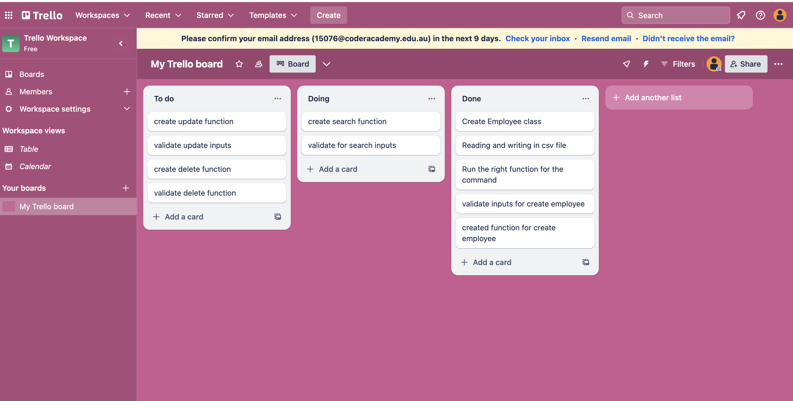
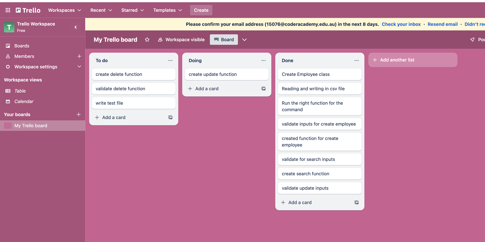
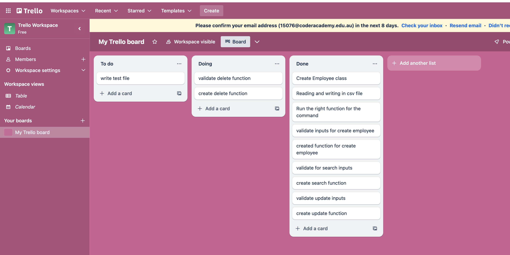
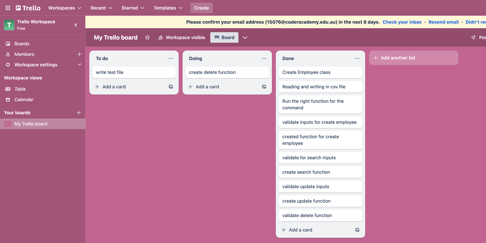
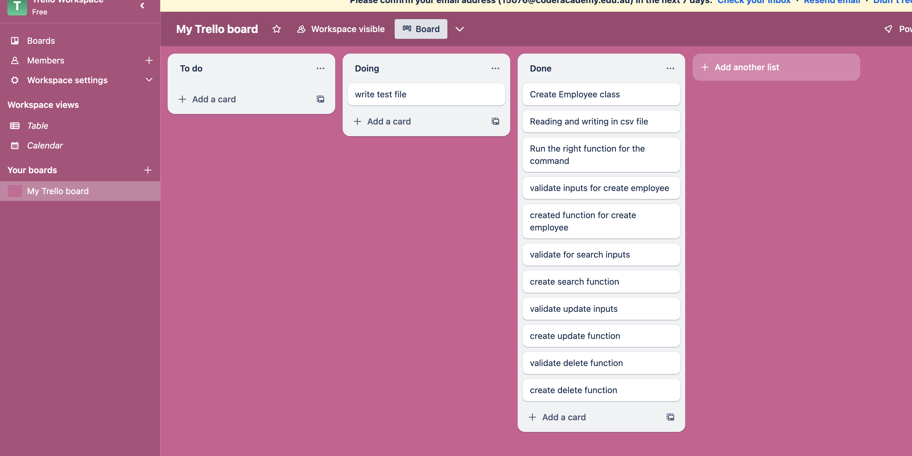

# THIS IS ESTHER FAITH DENNIS T1A3 

## Git repo
[link to git](https://github.com/estherszliu/EstherFaithDennis_T1A3)

## ### Presentation
[Link to presentation]()


# App Usage

### Create employees
```
employee _create <employee id> <first name> <last name>  <phone number> <job title> <salary> <start date>
```

### Search employees
```
employee search 
    --employee-id     <employee id>
    --first-name      <first name>
    --last-name       <last name>
    --phone-number    <phone number>
    --job-title       <job title>
    --max-salary      <max salary>
    --min-salary      <min salary>
    --max-start-date  <max start date>
    --min-start-date  <min start date>
```

### Update employees

```
employee update <employee id> 
    --first-name    <first name> 
    --last-name     <last name> 
    --phone-number  <phone number> 
    --job-title     <job title> 
    --salary        <salary> 
    --start-date    <start date> 
```
### Delete employees
```
employee delete <employee id>
```

# Project Planning

## Common functionality
* Create Employee class
    * Priority: High
    * Due Date: 11 Dec 2023 

* reading and writing in csv file
    * Priority: High
    * Due Date: 12 Dec 2023 
* run the right function for the command

### Validate inputs
- [ ] Validate employee ID
    * Priority: High
    * Due Date: 12 Dec 2023 
- [ ] Validate first name
    * Priority: High
    * Due Date: 12 Dec 2023 
- [ ] Validate last name
    * Priority: High
    * Due Date: 12 Dec 2023 
- [ ] Validate phone number
    * Priority: High
    * Due Date: 13 Dec 2023 
- [ ] Validate job title
    * Priority: High
    * Due Date: 13 Dec 2023 
- [ ] Validate salary
    * Priority: High
    * Due Date: 13 Dec 2023 
- [ ] Validate start date
    * Priority: High
    * Due Date: 13 Dec 2023 


## Feature - Create Employee
I will explain a plan for create employee feature

### How it will be implemented
It will be implemented with a `def valid_create_inputs(inputs)` for validate and a `def create_employee(employee_data)` function. The input data will be a list of inputs give by the user. It will check if the user input is correct before writing the new employee to a local csv file. 

### Task checklist for create employees
- [ ] Validate the number of input
    * Priority: High
    * Due Date: 12 Dec 2023 
- [ ] Validate the input is correct
    * Priority: High
    * Due Date: 13 Dec 2023 
- [ ] Print fail message to the user if the input is incorrect
    * Priority: Medium
    * Due Date: 14 Dec 2023 
- [ ] Write employee data to csv file
    * Priority: High
    * Due Date: 14 Dec 2023 
- [ ] Print fail message to the user if writing to the file is fail
    * Priority: Medium
    * Due Date: 14 Dec 2023 
- [ ] Print success message to the user
    * Priority: Medium
    * Due Date: 14 Dec 2023 

Most the task is high priority because create feature is needed for all other feature to work properly. 


## Feature - Search employee
I will explain a plan for search employee feature

### How it will be implemented
It will be implemented with a `def valid_search_inputs(inputs)`for validate and a `def search_employee(search_data))` function. The input data will be the employee's ID which will be the number by the user input. 

### Task checklist for search employees
- [ ] Validate the input is correct
    * Priority: High
    * Due Date: 15 Dec 2023 
- [ ] Print fail message to the user if the input incorrect
    * Priority: Medium
    * Due Date: 15 Dec 2023 
- [ ] Validate the input is match the employee data
    * Priority: High
    * Due Date: 15 Dec 2023 
- [ ] Print fail message to the user if the input can not found in the  employee data
    * Priority: Medium
    * Due Date: 15 Dec 2023 
- [ ] Print the employee data to the user
    * Priority: Medium
    * Due Date: 15 Dec 2023 

Most the task is high priority because search feature is needed for all other feature to work properly. 

## Feature - Update employee
I will explain a plan for update employee feature

### How it will be implemented
It will be implemented with a `def valid_update_inputs(inputs)`for validate and a `def update_data(update_employee)` function. The input data will be the employee's ID which will be the number by the user input. 

### Task checklist for update employees
- [ ] Validate the input is correct
    * Priority: High
    * Due Date: 16 Dec 2023 
- [ ] Print fail message to the user if the input incorrect
    * Priority: Medium
    * Due Date: 16 Dec 2023 
- [ ] Validate the input is match the employee data
    * Priority: High
    * Due Date: 16 Dec 2023 
- [ ] Print fail message to the user if the input can not found in the  employee data
    * Priority: Medium
    * Due Date: 16 Dec 2023 
- [ ] Print the employee data to the user
    * Priority: Medium
    * Due Date: 16 Dec 2023 

Most the task is high priority because update feature is needed for all other feature to work properly. 

## Feature - Delete employee
I will explain a plan for delete employee feature

### How it will be implemented
It will be implemented with a `def valid_delete_inputs(inputs)` for validate and `def delete_data(delete_employee)` function. The input data will be the employee's ID which will be the number by the user input. 

### Task checklist for delete employees
- [ ] Validate the input is correct
    * Priority: High
    * Due Date: 16 Dec 2023 
- [ ] Print fail message to the user if the input incorrect
    * Priority: Medium
    * Due Date: 16 Dec 2023 
- [ ] Validate the input is match the employee data
    * Priority: High
    * Due Date: 16 Dec 2023 
- [ ] Print fail message to the user if the input can not found in the  employee data
    * Priority: Medium
    * Due Date: 16 Dec 2023 
- [ ] Print the sucessful delete messege to the user
    * Priority: Medium
    * Due Date: 16 Dec 2023 

Most the task is high priority because delete feature is needed for all other feature to work properly. 

# Project mangement:

For the project mangement, I have been use Trello. Below are some screenshorts. 








# write Unittest for the app

* Write unittest test the create feature.

* Write unitest test the search feature. 

# Write help document to show how to use the program

* Written in `help_readme.md` in the docs folder.


# Code Style Guide
For code styling, I have chosen to usd PEP 8 – Style Guide for Python Code.Here is the link to [link toPEP8](https://peps.python.org/pep-0008/) (Hattori, n.d.) PEP8 helps to organise the code more consistency and help to improve the readerblity. I have been using the autopep8 to auto adjust the code style for me. Here is the link to [link to autopep8](https://pypi.org/project/autopep8/) (Hattori, n.d.) This autopep8 is a auto adjustment of PEP 8, once you download it and excute it, it will change the file style automaticaly.

## Reference
Hattori, H. (n.d.). autopep8: A tool that automatically formats Python code to conform to the PEP 8 style guide. [online] PyPI. Available at: https://pypi.org/project/autopep8/.

Hattori, H. (n.d.). autopep8: A tool that automatically formats Python code to conform to the PEP 8 style guide. [online] PyPI. Available at: https://pypi.org/project/autopep8/.